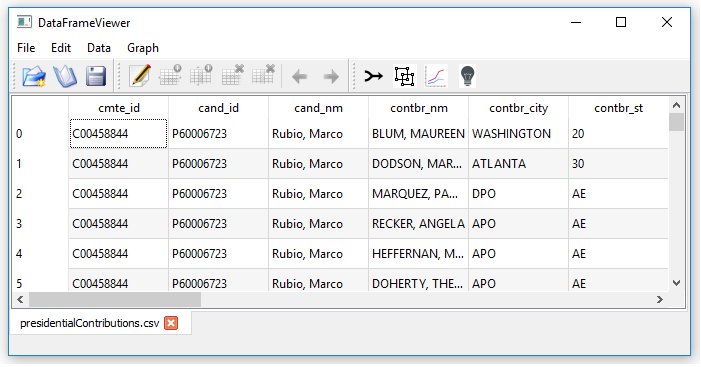
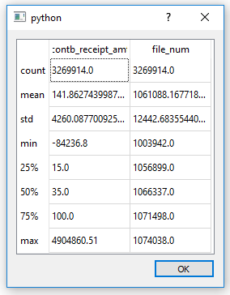
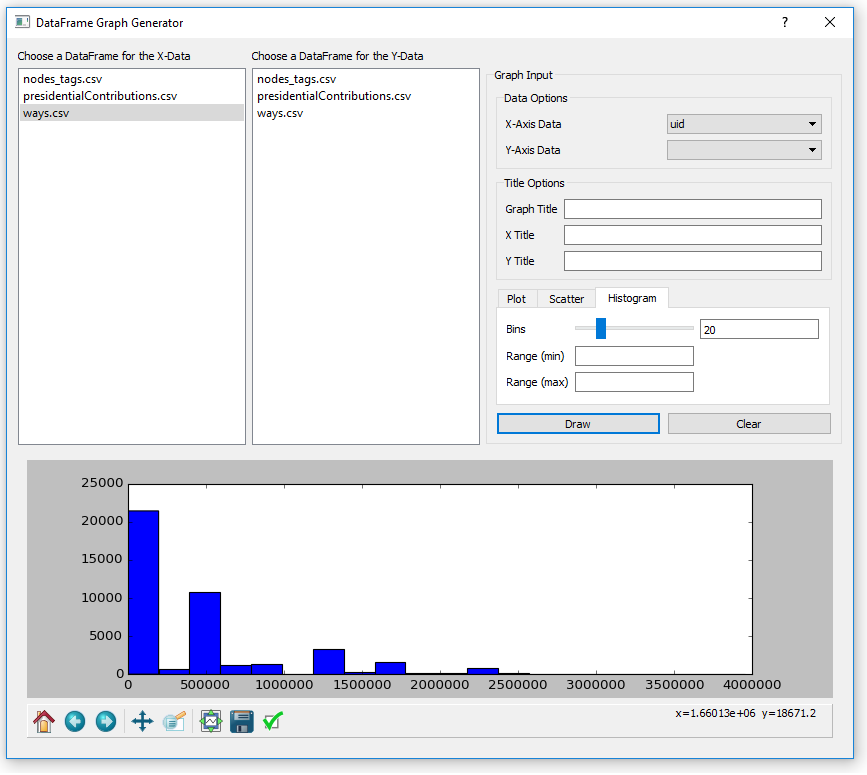
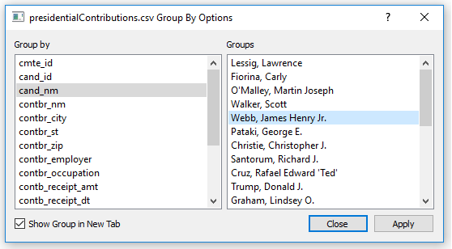
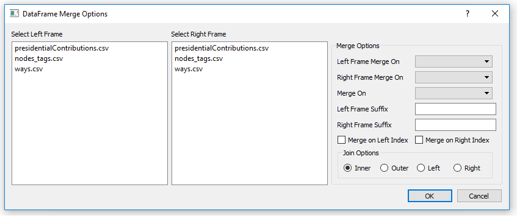

# dfViewer
A cross-platform PyQt GUI for visualizing pandas dataframes in table format.  Implements some pandas operations, 
and includes a GUI for basic plotting with matplotlib.

#### Features:
Currently reads files of the following formats: 
  * Excel 
  * comma delimited or white-space delimited 

Built-in Graph Generator for plotting data  
Merge tool for merging multiple dataframes
Group-by tool for selecting subsets of data

#### Requirements:
Python 3.x 
pandas 
numpy 
matplotlib 
PyQt4 
Or the Anaconda3 distribution 

#### Known Issues:
Currently an issue with libpng and at least of of the images used in the tool bar. 
libpng warning: iCCP: known incorrect sRGB profile 
libpng warning: cHRM: inconsistent chromaticities 
libpng warning: iCCP: known incorrect sRGB profile 
libpng warning: cHRM: inconsistent chromaticities 

#### Screenshots
Main Window 
 
pandas describe function 
 
Graph dialog 
 
Group-by dialog 
 
Merge dialog 
 
